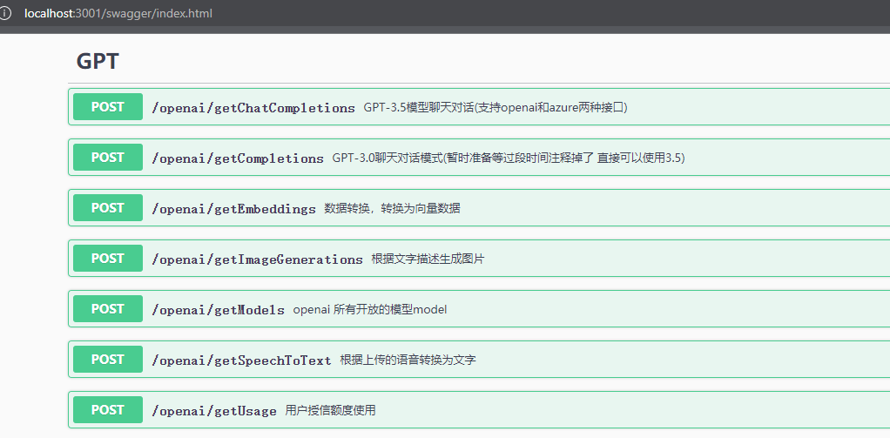

## 目前对接过的几个OpenAI 接口


## GPT-3.5模型聊天 (可以支持openai的api，也可以支持azure云服务中的api接口)
其他的接口暂未支持通用


通过配置相关参数即可

将config.example.json中的配置

```
  // type：azure则为azure云服务
  "gptconfig": {
    "type": "azure",
    "url": "https://xxxx.openai.azure.com",
    "apikey": "xxxxxxx"
  },
```

```
  // type：openai则为openai官网的api
  "gptconfig": {
    "type": "openai",
    "url": "https://xxxx.openai.azure.com",
    "apikey": "xxxxxxx"
  },
```

## 前端展示页面在这个仓库
- https://github.com/aehyok/vue-qiankun

## 切换为国内的仓库源
```
go env -w GOPROXY=https://mirrors.aliyun.com/goproxy/,direct
```

## swag 中文官网
```
https://github.com/swaggo/swag/blob/master/README_zh-CN.md
```
## swag init command not found 
```
// 则运行 
go install github.com/swaggo/swag/cmd/swag
```

## swagger注解
```
// 修改完注释和配置要记得重新生成docs

swag init
```

## 编译发布到linux
```
// 生成接口文档
swag init 

// 打包编译脚本
CGO_ENABLED=0 GOOS=linux GOARCH=amd64 go build
```
编译完后会生成一个geekdemo的go 文件，直接拷贝到服务器/usr/local/sunlight/go/course

> 如果拷贝不了

```
// 停止服务
systemctl stop geekdemo

// 再去拷贝文件

// 再开启服务
systemctl start geekdemo
```

## 部署到linux做成systemd服务
```
// geek.service

[Unit]
Description=geekdemo
After=network-online.target
Wants=network-online.target

[Service]
# modify when deploy in prod env
Type=simple
#Environment="GIN_MODE=release"
ExecStart=/usr/local/sunlight/go/course/geekdemo
WorkingDirectory=/usr/local/sunlight/go/course

Restart=always
RestartSec=1
StartLimitInterval=0

[Install]
WantedBy=multi-user.target

```

## 设置go服务
```
// 设置开机启动
systemctl enable geekdemo.service

// 启动服务
systemctl start geekdemo.service

// 停止服务
systemctl stop geekdemo.service

// 重新加载配置文件
sytemctl daemon-reload

// 查看服务状态
systemctl status geekdemo.service

// 查看运行日志
journalctl -u geekdemo -f
```
